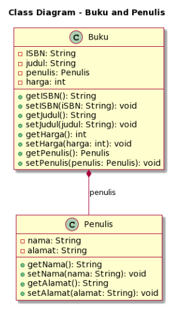

<h1 align="center">

LAPORAN UTS

Pemprograman Berorerientasi Objek


<h2 align="center">

RIZQI REZA DANUARTA

2241720057

TI-2C

### Soal 1: Penulisan Class

Berdasarkan contoh class ClassA di bawah ini, jelaskan apakah penulisan source code pada contoh
class tersebut sudah benar. Jika tidak, apa yang perlu diperbaiki?

```java
public class ClassA {
    float f1 = 0.15f;

    float hitung() {
        float x = 2f * f1;
    }
}
```

Jawaban : pada method hitung tidak mengembalikan nilai void dimana seharusnya method hitung harus mengambalikan nilai dari tipe data float atau menggunakan pernyataan return. Perbaikan code yang benar adalah sebagai berikut ini<br>

```java
float hitung() {
    float x = 2f * f1;
    return x;
}

```

### Soal 2: Perhitungan Jumlah Elemen Array 2 Dimensi

Pada class SoalArray1, terdapat array 2 dimensi dengan ukuran 3x3. Tuliskan code Java untuk menghitung jumlah total elemen array tersebut dengan menggunakan perulangan.

```java
public class SoalArray1 {
    public static void main(String[] args) {
        int[][] arrayInt = {{1, 1, 4}, {2, 1, 2}, {3, 2, 1}};
        // hitung jumlah elemen array 2 dimensi
        // gunakan perulangan
    }
}
```

jawaban : untuk menghitung jumlah total elemen array tersebut dengan menggunakan perulanga maka source code seperti berikut<br>

```java
int total = 0 ;
for (int i = 0; i < arrayInt.length; i++) {
            for (int j = 0; j < arrayInt[i].length; j++) {
                total += arrayInt[i][j];
            }
        }
System.out.println("Jumlah total elemen array: " + total);
```

hasil output maka akan seperti berikut ini

```java
Jumlah total elemen array: 17
```

diatas adalah source code untuk mwnghitung jumlah total elemen array

### Soal 3: Pewarisan Atribut dan Method

Pada source code yang diberikan, class ClassY merupakan turunan dari class Class. Sebutkan atribut dan method apa saja yang diwarisi oleh ClassY dari kelas induknya (class Class). Jelaskan juga apa output dari code yang ditulis pada class ClassY dan bagaimana nilai tersebut diperoleh

```java
public class Class {
    int a = 2;
    int x = 0;

    int hitung() {
        x = x + 5 * a;
        return x;
    }
}

public class ClassY extends Class {
    int b = 5;
    int y = 0;

    int hitungY() {
        y = hitung() * b;
        return y;
    }

    public static void main(String[] args) {
        ClassY cy = new ClassY();
        System.out.println(cy.hitungY());
    }
}
```

jawaban : ClassY adalah turunan dari Class, sehingga mewarisi atribut dan metode dari Class. Dari Class, ClassY mewarisi atribut a dan x, serta metode hitung(). Selain itu, ClassY memiliki atribut tambahan b. Dalam metode main di ClassY, sebuah objek cy (instansiasi dari ClassY) dibuat, dan metode hitungY() dipanggil pada objek tersebut. Di dalam metode hitungY(), terdapat pemanggilan metode hitung() yang diwarisi dari Class. Metode hitung() mengubah nilai atribut x dengan menghitungnya menggunakan atribut a. Hasil dari hitungY() adalah y, yang dihitung sebagai y = x _ b. Hasil dari cy.hitungY() adalah 50, yang merupakan hasil perhitungan berikut: Pertama, metode cy.hitung() dipanggil dari cy, yang mengubah nilai x menjadi 10 dengan rumus x = x + 5 _ a. Kemudian, nilai y dihitung sebagai y = x _ b, yang menjadi 10 _ 5 = 50. Hasil ini kemudian dicetak ke layar menggunakan System.out.println().

### Soal 4: Class Mahasiswa dengan Constructor

Dalam class Mahasiswa, lengkapi code dengan:
a. Menambahkan constructor untuk mengisi atribut nim, nama, alamat, dan jenisKelamin.
b. Membuat objek mahasiswa dan mengisi atribut nim, nama, alamat, dan jenisKelamin melalui constructor.

```java
public class Mahasiswa {
    String nim, nama, alamat;
    char jenisKelamin;

    // a. Tambahkan constructor
    // Gunakan constructor untuk
    // mengisi atribut nim, nama, alamat, jenisKelamin

    public static void main(String[] args) {
        // b. Buat objek mahasiswa
        // Isi atribut nim, nama, alamat, jenisKelamin
        // lewat constructor
    }
```

jawaban : maka source code akan seperti berikut ini

```java
public class Mahasiswa {
    String nim, nama, alamat;
    char jenisKelamin;

    public Mahasiswa(String nim, String nama, String alamat, char jenisKelamin) {
        this.nim = nim;
        this.nama = nama;
        this.alamat = alamat;
        this.jenisKelamin = jenisKelamin;
    }

    public static void main(String[] args) {
        Mahasiswa mahasiswa1 = new Mahasiswa("2241720057", "Rizqi Reza Danuarta", "Kediri", 'L');
    }
}
```

### Soal 5: OOP Buku -> Penulis

Perhatikan class diagaram berikut dan Buatlah Source code dalam Bahasa java berdasarkan class diagram tersebut


jawaban :

- berikut adalah Class buku dengan nama class Book

```java
package source_code;

public class Book {
    public class Buku {
        private String ISBN;
        private String judul;
        private Author author;
        private int harga;

        public String getISBN() {
            return ISBN;
        }

        public void setISBN(String iSBN) {
            ISBN = iSBN;
        }

        public String getJudul() {
            return judul;
        }

        public void setJudul(String Judul) {
            judul = Judul;
        }

        public int getHarga() {
            return harga;
        }

        public void setHarga(int Harga) {
            harga = Harga;
        }

        public Author getAuthor() {
            return author;
        }

        public void setAuthor(Author author) {
            author = author;
        }
    }

}
```

- berikut adalah Class penulis dengan nama class Author

```java
package source_code;

public class Author {
    private String nama;
    private String alamat;

    public String getNama() {
        return nama;
    }

    public void setNama(String Nama) {
        nama = Nama;
    }

    public String getAlamat() {
        return alamat;
    }

    public void setAlamat(String Alamat) {
        alamat = Alamat;
    }
}

```
