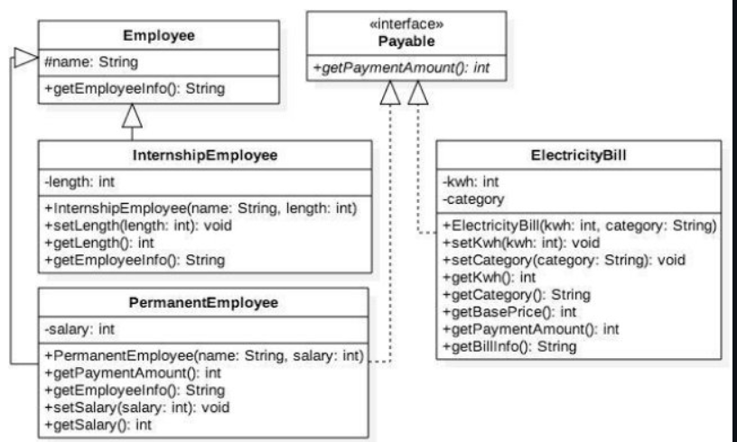
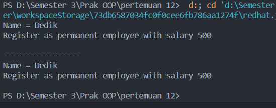
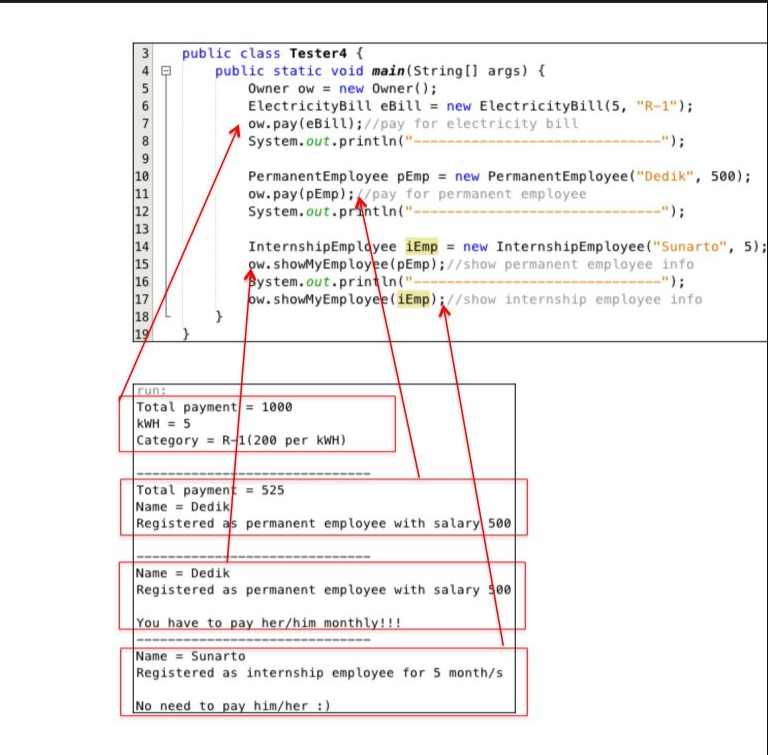
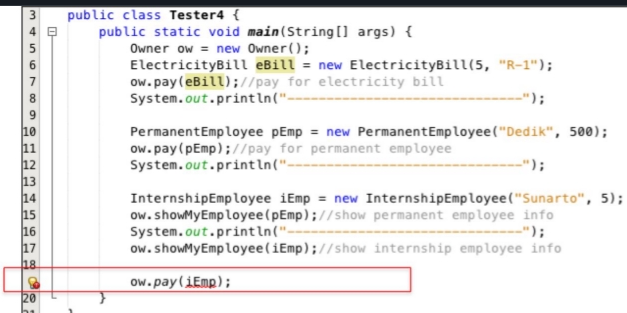
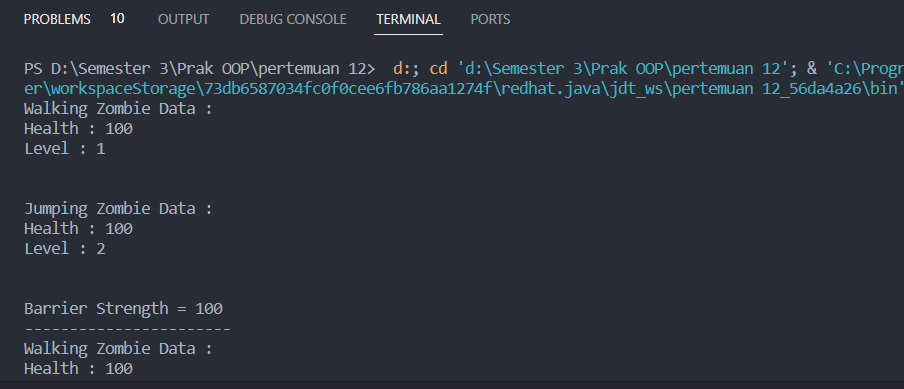
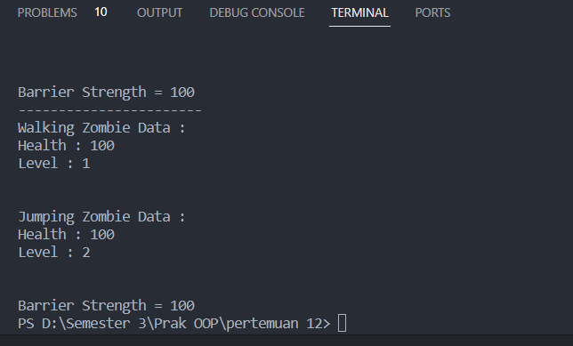

<h1 align="center">

LAPORAN PRAKTIKUM

Pemprograman Berorerientasi Objek


<h2 align="center">

RIZQI REZA DANUARTA

2241720057

TI-2C

### STUDI KASUS



### Latihan Praktikum 4.1

- class employee

```java
package Code.percobaan;

public class Employe {
    protected String name;

    public String getEmployeeInfo() {
        return "Name = " + this.name;
    }

}
```

- class Payable

```java
package Code.percobaan;

public interface Payable {
    public int getPaymentAmount();
}

```

- class class InternshipEmployee, subclass dari Employee

```java
package Code.percobaan;

public class InternshipEmploye extends Employe {
    private int length;

    public InternshipEmploye(String name, int length) {
        this.length = length;
        this.name = name;
    }

    public int getLength() {
        return length;
    }

    public void setLength(int length) {
        this.length = length;
    }

    public String getEmployeeInfo() {
        String info = super.getEmployeeInfo() + "\n";
        info += "Registered as internship employee for " + length + " month/s\n";
        return info;
    }
}
```

- class PermanentEmployee, subclass dari Employee dan implements ke Payable

```java
package Code.percobaan;

public class PermanentEmploye extends Employe implements Payable {
    private int salary;

    public PermanentEmploye(String name, int salary) {
        this.name = name;
        this.salary = salary;
    }

    public int getSalary() {
        return salary;
    }

    public void setSalary(int salary) {
        this.salary = salary;
    }

    public int getPaymentAmount() {
        return (int) (salary + 0.5 * salary);
    }

    public String getEmployeeInfo() {
        String info = super.getEmployeeInfo() + "\n";
        info += "Register as permanent employee with salary " + salary + "\n";
        return info;
    }
}

```

- class class ElectricityBill yang implements ke interface Payable

```java
package Code.percobaan;

public class ElectricityBill implements Payable {
    private int kwh;
    private String category;

    public ElectricityBill(int kwh, String category) {
        this.kwh = kwh;
        this.category = category;
    }

    public int getKwh() {
        return kwh;
    }

    public void setKwh(int kwh) {
        this.kwh = kwh;
    }

    public String getCategory() {
        return category;
    }

    public void setCateogry(String category) {
        this.category = category;
    }

    public int getPaymentAmount() {
        return kwh * getBasePrice();
    }

    public int getBasePrice() {
        int bPrice = 0;
        switch (category) {
            case "R-1":
                bPrice = 100;
                break;
            case "R-2":
                bPrice = 200;
                break;
        }
        return bPrice;
    }

    public String getBillInfo() {
        return "kWH = " + kwh + "\n" + "Category = " + category + "(" + getBasePrice() + " per kWH)\n";
    }
}

```

- class tester1

```java
package Code.percobaan;

public class MainPertama {
    public static void main(String[] args) {
        PermanentEmploye pEmp = new PermanentEmploye("Dedik", 500);
        InternshipEmploye iEmp = new InternshipEmploye("Sunarto", 5);
        ElectricityBill eBill = new ElectricityBill(5, "A-1");
        Employe e;
        Payable p;
        e = pEmp;
        e = iEmp;
        p = pEmp;
        p = eBill;
    }

}
```

## 4.2 Pertanyaan

Class apa sajakah yang merupakan turunan dari class Employee?

Jawab : InternshipEmployee dan PermanentEmployee merupakan turunan/subClass dari Class Employee.

Class apa sajakah yang implements ke interface Payable?

Jawab :Class yang mengimplements ke interface Payable adalah Class PermanenetEmployee dan ElectrictyBill.

Perhatikan class Tester1, baris ke-10 dan 11. Mengapa e, bisa diisi dengan objek pEmp (merupakan objek dari class PermanentEmployee) dan objek iEmp (merupakan objek dari class InternshipEmploye) ?

Jawab : Karena class PermanentEmployee dan InternshipEmployee merupakan subClass dari "e" yang merupakan objek dari SuperClass mereka.

Perhatikan class Tester1, baris ke-12 dan 13. Mengapa p, bisa diisi denganobjekpEmp (merupakan objek dari class PermanentEmployee) dan objek eBill (merupakan objek dari class ElectricityBill) ?

Jawab : Karena pEmp dan eBill merupakan objek yang mengimplementasikan isi dari objek p dari Class Payable.

Coba tambahkan sintaks:
p = iEmp; e = eBill;
pada baris 14 dan 15 (baris terakhir dalam method main) ! Apa yang menyebabkan error?

Jawab : Karena mereka iEmp merupakan objek dari Class InternshipEmployee yang tidak ada relasi dengan implementasi Class objek p. Begitu juga dengan e=Ebill, dikaernakan objek "e" berasal dari class employee yang tidak ada kaitannya dengan eBill yang berasal dari Class ElectricityBill.

Ambil kesimpulan tentang konsep/bentuk dasar polimorfisme!

Jawab : Polimorfisme merupakan konsep relasi antar kelas berdasarkan kesamaan fungsi/method dengan menggunakan extends untuk menyambungkan antar SuperClass dan SubClass, dimana Class yang memiliki extends berarti dia mengambil isi dari Class lain untuk diimplementasikan pada class tersebut.

### Latihan Praktikum 5.1

Pada percobaan ini masih akan digunakan class-class dan interface yang digunakan pada percobaan sebelumnya.
Buat class baru dengan nama Tester2.

- tester2

```java
package Code.percobaan;

public class MainKedua {
    public static void main(String[] args) {
        PermanentEmploye pEmp = new PermanentEmploye("Dedik", 500);
        Employe e;
        e = pEmp;
        System.out.println("" + e.getEmployeeInfo());
        System.out.println("-----------------");
        System.out.println("" + pEmp.getEmployeeInfo());
    }

}
```



## 5.2 Pertanyaan

Perhatikan class Tester2 di atas, mengapa pemanggilan e.getEmployeeInfo() pada baris 8 dan pEmp.getEmployeeInfo() pada baris 10 menghasilkan hasil\*\* sama?

Jawab : Karena ketika dilakukan e = pEmp maka nilai e akan menjadi sama seperti pEmp karena Class dari pEmp merupakan subClass dari Class milik objek "e". Sehingga ketika dilakukan pemanggilan tentu akan menghasilkan hasil yang sama.

Mengapa pemanggilan method e.getEmployeeInfo() disebut sebagai pemanggilan method virtual (virtual method invication), sedangkan pEmp.getEmployeeInfo() tidak?

Jawab : Karena dilakukan polimorfisme terhadap pEmp ke e. Hal ini yang membuat e.getEmployeeInfo() dinamakan virtual method invication.

Jadi apakah yang dimaksud dari virtual method invocation? Mengapa disebut virtual?

Jawab : Karena mengakses method yang tidak secara langsung dibuat khusus untuk class tersebut melainkan mengambil/dilakukan polimorfisme terhadap Class lain.

### Latihan Praktikum 6.1

Pada percobaan ke-3 ini, masih akan digunakan class-class dan interface pada percobaan sebelumnya.
Buat class baru Tester3.

- tester 3

```java
package Code.percobaan;

public class MainKetiga {
    public static void main(String[] args) {
        PermanentEmploye pEmp = new PermanentEmploye("Dedik", 500);
        InternshipEmploye iEmp = new InternshipEmploye("Sunarto", 5);
        ElectricityBill eBill = new ElectricityBill(5, "A-1");
        Employe e[] = { pEmp, iEmp };
        Payable p[] = { pEmp, eBill };
        // Employee e2[] = {pEmp,iEmp,eBill}; tidak bisa karena error
    }
}

```

## 6.2 Pertanyaan

Perhatikan array e pada baris ke-8, mengapa ia bisa diisi dengan objek- objek dengan tipe yang berbeda, yaitu objek pEmp (objek dari PermanentEmployee) dan objek iEmp (objek dari InternshipEmployee) ?

Jawab : Karena pEmp dan iEmp berasal dari Class yang merupakan subClass dari objek e. sehingga ketika dibuat array oleh e[] maka pEmp dan iEmp dapat dimasukkan dalam array tersebut.

Perhatikan juga baris ke-9, mengapa array p juga biisi dengan objek-objek dengan tipe yang berbeda, yaitu objek pEmp (objek dari PermanentEmployee) dan objek eBill (objek dari ElectricityBilling) ?

Jawab : Karena Class kedua objek tersebut melakukan implements terhadap Class Payable, sehingga masih berkaitan atara Class-Class tersebut.

Perhatikan baris ke-10, mengapa terjadi error?

Jawab : Karena meski pEmp dan iEmp memiliki relasi polimorfisme dengan Class Employee namun objek eBill dari Class ElectricityBill tidak berelasi sama sekali dengan Class Employee sehingga menimbulkan Error.

### Percobaan 7.1

Percobaan 4 ini juga masih menggunakan class-class dan interface yang digunakan pada percobaan sebelumnya.

Buat class baru dengan nama Owner. Owner bisa melakukan pembayaran baik kepada pegawai permanen maupun rekening listrik melalui method pay(). Selain itu juga bisa menampilkan info pegawai permanen maupun pegawai magang melalui method showMyEmployee().

- owner

```java
package Code.percobaan;

public class owner {
    public void pay(Payable p) {
        System.out.println("Total payment = " + p.getPaymentAmount());
        if (p instanceof ElectricityBill) {
            ElectricityBill eb = (ElectricityBill) p;
            System.out.println("" + eb.getBillInfo());
        } else if (p instanceof PermanentEmploye) {
            PermanentEmploye pe = (PermanentEmploye) p;
            pe.getEmployeeInfo();
            System.out.println("" + pe.getEmployeeInfo());
        }
    }

    public void showEmployee(Employe e) {
        System.out.println("" + e.getEmployeeInfo());
        if (e instanceof PermanentEmploye)
            System.out.println("You have to pay her/him monthly!!");
        else
            System.out.println("No need to pay him/her :)");
    }
}

```

- tester 4

```java
package Code.percobaan;

import java.security.acl.Owner;

public class MainKeempat {
 public static void main(String[] args) {
        owner ow = new owner();
        ElectricityBill eBill = new ElectricityBill(5, "R-1");
        ow.pay(eBill);
        System.out.println("---------------------------------------");

        PermanentEmploye pEmp = new PermanentEmploye("Dedik", 500);
        ow.pay(pEmp);
        System.out.println("---------------------------------------");

        IntershipEmploye iEmp = new IntershipEmploye("Sunarto", 5);
        ow.showEmployee(pEmp);
        System.out.println("---------------------------------------");
        ow.showEmployee(iEmp);
    }
}

```

Jalankan class Tester4, dan akan didaptkan hasil sebagai berikut:


## 7.2 Pertanyaan

Perhatikan class Tester4 baris ke-7 dan baris ke-11, mengapa pemanggilan ow.pay(eBill) dan ow.pay(pEmp) bisa dilakukan, padahal jika diperhatikan method pay() yang ada di dalam class Owner memiliki argument/parameter bertipe Payable? Jika diperhatikan lebih detil eBill merupakan objek dari ElectricityBill dan pEmp merupakan objek dari PermanentEmployee?

Jawab : Karena Class ElectricityBill dan PermanentEmployee memiliki relasi implements terhadap Class Payable sehingga mereka telah menyimpan nilai untuk payable dan ketika dilakukan ow.pay(eBill)/ow.pay(pEmp) tidak terjadi error dan dapat dilakukan.

Jadi apakah tujuan membuat argument bertipe Payable pada method pay() yang ada di dalam class Owner?

Jawab : Agar dapat memanggil objek yang memiliki nilai Class Payable sehingga dapat diimplementasikan/dikaitkan pada parameter method tersebut.

Coba pada baris terakhir method main() yang ada di dalam class Tester4 ditambahkan perintah ow.pay(iEmp);

Mengapa terjadi error?

Jawab : Karena iEmp dari Class InternshipEmployee tidak dikaitkan atau tidak dilakukan implements terhadap Class Payable sehingga CLass InternshipEmployee tidak menyimpan nilai Class Payable, karena ini terjadi error pada ow.pay(iEmp).

Perhatikan class Owner, diperlukan untuk apakah sintaks p instanceof ElectricityBill pada baris ke-6 ?

Jawab : instanceof digunakan untuk melakukan cek apakah objek p berasal dari Class ElectricityBill ataukah tidak.

Perhatikan kembali class Owner baris ke-7, untuk apakah casting objek disana (ElectricityBill eb = (ElectricityBill) p) diperlukan ? Mengapa objek p yang bertipe Payable harus di-casting ke dalam objek eb yang bertipe ElectricityBill ?

Jawab : Agar dapat melakukan pemanggilan method yang terdapat dari Class yang di-casting yaitu Class ElectricityBill.

### TUGAS

```java
package Code.tugas;

public class Barrier implements Destroyable {
    private int Strength;

    Barrier(int Strength) {
        this.Strength = Strength;
    }

    public void setStrength(int strength) {
        this.Strength = strength;
    }

    public int getStrength() {
        return Strength;
    }

    public void Destroyed() {
        Strength -= 9;
    }

    public String getBarrierInfo() {
        return "\nBarrier Strength = " + Strength;
    }
}
package Code.tugas;

public interface Destroyable {
    public void Destroyed();
}
package Code.tugas;

public class JumpingZombie extends Zombie implements Destroyable {
    JumpingZombie(int health, int level) {
        this.health = health;
        this.level = level;
    }

    public void heal() {
        if (level == 1) {
            health += 30;
        } else if (level == 2) {
            health += 40;
        } else if (level == 3) {
            health += 50;
        }
    }

    public void Destroyed() {
        health -= 1;
    }

    public String getZombieInfo() {
        String info = "\nJumping Zombie Data :";
        info += "\nHealth : " + health;
        info += "\nLevel : " + level + "\n";
        return info;
    }
}
package Code.tugas;

public class Plant implements Destroyable {
    public void doDestroy(Destroyable d) {

    }

    @Override
    public void Destroyed() {
        // TODO Auto-generated method stub
        throw new UnsupportedOperationException("Unimplemented method 'Destroyed'");
    }

    public void doDestroy(Barrier b) {
    }
}
package Code.tugas;

public class PlayTest {
    public static void main(String[] args) {
        WalkingZombie wz = new WalkingZombie(100, 1);
        JumpingZombie jz = new JumpingZombie(100, 2);
        Barrier b = new Barrier(100);
        Plant p = new Plant();
        System.out.println("" + wz.getZombieInfo());
        System.out.println("" + jz.getZombieInfo());
        System.out.println("" + b.getBarrierInfo());
        System.out.println("-----------------------");
        for (int i = 0; i < 4; i++) {
            p.doDestroy(wz);
            p.doDestroy(jz);
            p.doDestroy(b);
        }
        System.out.println("" + wz.getZombieInfo());
        System.out.println("" + jz.getZombieInfo());
        System.out.println("" + b.getBarrierInfo());
    }

}
package Code.tugas;

public class WalkingZombie extends Zombie implements Destroyable {

    WalkingZombie(int health, int level) {
        this.health = health;
        this.level = level;
    }

    public void heal() {
        if (level == 1) {
            health += 10;
        } else if (level == 2) {
            health += 30;
        } else if (level == 3) {
            health += 40;
        }
    }

    public void Destroyed() {
        health -= 2;
    }

    public String getZombieInfo() {
        String info = "Walking Zombie Data :";
        info += "\nHealth : " + health;
        info += "\nLevel : " + level + "\n";
        return info;
    }
}
package Code.tugas;

public class Zombie implements Destroyable {
    // Tiap menyerang sebanyak 5 kali, maka akan naik level.
    int level;
    int health;

    public void Destroyed() {
        health -= 2;
    }

    public void heal(int level) {
        if (level == 1) {
            health += 10;
        } else if (level == 2) {
            health += 20;
        } else if (level == 3) {
            health += 30;
        }
    }

    public String getZombieInfo() {
        String info = "Health : " + health;
        info += "\nLevel : " + level;
        return info;
    }
}
```



