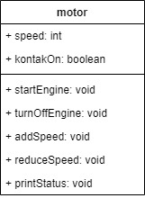
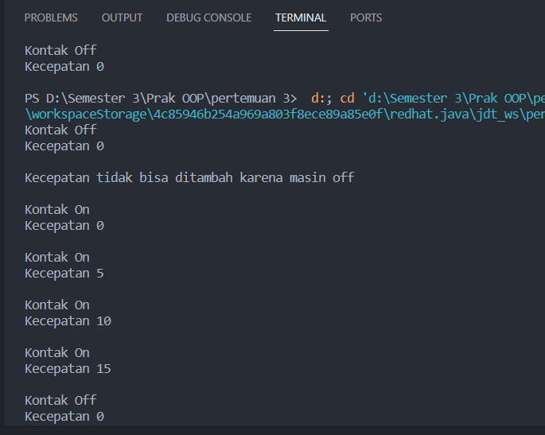
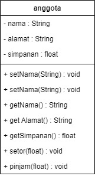
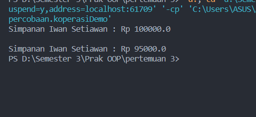
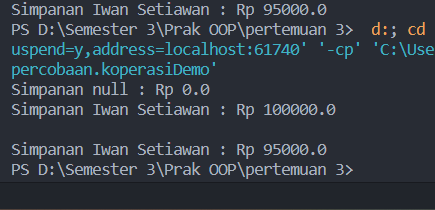
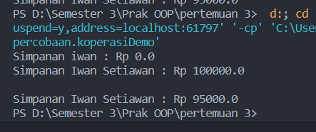
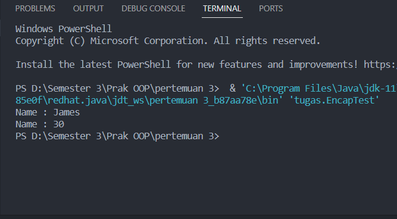

<h1 align="center">

LAPORAN PRAKTIKUM

Pemprograman Berorerientasi Objek


<h1 align="center">

RIZQI REZA DANUARTA

2241720057

TI-2C

### Percobaan Praktikum 3.1

1. Buka Netbeans, buat project MotorEncapsulation.
2. Buat class Motor. Klik kanan pada package motorencapsulation – New – Java Class.
3. Ketikkan kode class Motor dibawah ini.

```java
package percobaan;

/**
 * motor
 */
public class motor {
    public int speed = 0;
    public boolean kontakOn = false;

    public void printStatus() {
        if (kontakOn == true) {
            System.out.println("Kontak On");
        } else {
            System.out.println("Kontak Off");
        }
        System.out.println("Kecepatan " + speed + "\n");
    }
}
package percobaan;

public class motorDemo {
    public static void main(String[] args) {
        motor mntr = new motor();
        mntr.printStatus();
        mntr.speed = 50;
        mntr.printStatus();
    }
}
```

hasil outputnya


Dari percobaan 1 - enkapsulasi, menurut anda, adakah yang janggal?  
Yaitu, kecepatan motor tiba-tiba saja berubah dari 0 ke 50. Lebih janggal lagi, posisi kontak motor
masih dalam kondisi OFF. Bagaimana mungkin sebuah motor bisa sekejap berkecepatan dari nol ke
50, dan itupun kunci kontaknya OFF?  
Nah dalam hal ini, akses ke atribut motor ternyata tidak terkontrol. Padahal, objek di dunia nyata
selalu memiliki batasan dan mekanisme bagaimana objek tersebut dapat digunakan. Lalu,
bagaimana kita bisa memperbaiki class Motor diatas agar dapat digunakan dengan baik? Kita bisa
pertimbangkan beberapa hal berikut ini:

1. Menyembunyikan atribut internal (kecepatan, kontakOn) dari pengguna (class lain)
2. Menyediakan method khusus untuk mengakses atribut.  
   Untuk itu mari kita lanjutkan percobaan berikutknya tentang Access Modifier.

### Latihan Praktikum 3.2

Pada percobaan ini akan digunakan access modifier untuk memperbaiki cara kerja class Motor pada
percobaan ke-1.

1. Ubah cara kerja class motor sesuai dengan UML class diagram berikut.

 <br>

2. Berdasarkan UML class diagram tersebut maka class Motor terdapat perubahan, yaitu:

a. Ubah access modifier kecepatan dan kontakOn menjadi private
b. Tambahkan method nyalakanMesin, matikanMesin, tambahKecepatan,
kurangiKecepatan.
Implementasi class Motor adalah sebagai berikut:

```java
package percobaan;

/**
 * motor
 */
public class motor {
    private int speed = 0;
    private boolean kontakOn = false;

    public void startEngine() {
        kontakOn = true;
    }

    public void turnOffEngine() {
        kontakOn = false;
        speed = 0;
    }

    public void addSpeed() {
        if (kontakOn == true) {
            speed += 5;
        } else {
            System.out.println("Kecepatan tidak bisa ditambah karena masin off \n");
        }
    }

    public void reduceSpeed() {
        if (kontakOn == true) {
            speed -= 5;
        } else {
            System.out.println("Kecepatan tidak bisa ditambah karena mesin off \n");
        }
    }

    public void printStatus() {
        if (kontakOn == true) {
            System.out.println("Kontak On");
        } else {
            System.out.println("Kontak Off");
        }
        System.out.println("Kecepatan " + speed + "\n");
    }
}
package percobaan;

public class motorDemo {
    public static void main(String[] args) {
        motor mntr = new motor();
        // percobaan 1
        // mntr.printStatus();
        // mntr.speed = 50;
        // mntr.printStatus();

        // percobaan 2
        mntr.printStatus();
        mntr.addSpeed();

        mntr.startEngine();
        mntr.printStatus();

        mntr.addSpeed();
        mntr.printStatus();

        mntr.addSpeed();
        mntr.printStatus();

        mntr.addSpeed();
        mntr.printStatus();

        mntr.turnOffEngine();
        mntr.printStatus();
    }
}
```

### Hasil Output

<br>

Dari percobaan diatas, dapat kita amati sekarang atribut kecepatan tidak bisa diakses oleh pengguna
dan diganti nilainya secara sembarangan. Bahkan ketika mencoba menambah kecepatan saat posisi
kontak masih OFF, maka akan muncul notifikasi bahwa mesin OFF. Untuk mendapatkan kecepatan

yang diinginkan, maka harus dilakukan secara gradual, yaitu dengan memanggil method
tambahKecepatan() beberapa kali. Hal ini mirip seperti saat kita mengendarai motor.  
3.3 Pertanyaan

1. Pada class TestMobil, saat kita menambah kecepatan untuk pertama kalinya, mengapa
   muncul peringatan “Kecepatan tidak bisa bertambah karena Mesin Off!”?
2. Mengapat atribut kecepatan dan kontakOn diset private?
3. Ubah class Motor sehingga kecepatan maksimalnya adalah 100!

### Latihan Praktikum 3.4

Misalkan di sebuah sistem informasi koperasi, terdapat class Anggota. Anggota memiliki atribut
nama, alamat dan simpanan, dan method setter, getter dan setor dan pinjam. Semua atribut pada
anggota tidak boleh diubah sembarangan, melainkan hanya dapat diubah melalui method setter,
getter, setor dan tarik. Khusus untuk atribut simpanan tidak terdapat setter karena simpanan akan
bertambah ketika melakukan transaksi setor dan akan berkurang ketika melakukan
peminjaman/tarik.

1.  Berikut ini UML class buatlah class Mahasiswa pada program:

2.  Sama dengan percobaan 1 untuk membuat project baru

        a. Buka Netbeans, buat project KoperasiGetterSetter.
        b. Buat class Anggota. Klik kanan pada package     koperasigettersetter – New – Java Class.
        c. Ketikkan kode class Anggota dibawah ini.

<br>

```java
package percobaan;

public class anggota {
    private String nama;
    private String alamat;
    private float simpanan;

    public void setNama(String nama) {
        this.nama = nama;
    }

    public void setAlamat(String alamat) {
        this.alamat = alamat;
    }

    public String getNama() {
        return nama;
    }

    public String getAlamat(){
        return alamat;
    }

    public float getSimpanan(){
        return simpanan;
    }

    public void setor(float uang){
        simpanan += uang;
    }

    public void pinjam(float uang){
        simpanan -= uang;
    }
}
package percobaan;

public class koperasiDemo {
    public static void main(String[] args) {
        anggota anggota1 = new anggota();
        anggota1.setNama("Iwan Setiawan");
        anggota1.setAlamat("Jalan Sukarno Hattta no 10");
        anggota1.setor(100000);
        System.out.println("Simpanan " + anggota1.getNama() + " : Rp " + anggota1.getSimpanan());
        System.out.println();
        anggota1.pinjam(5000);
        System.out.println("Simpanan " + anggota1.getNama() + " : Rp " + anggota1.getSimpanan());
    }
}

```

### Hasil Output



### Percobaan Praktikum 3.5

```java
package percobaan;

public class koperasiDemo {
    public static void main(String[] args) {
        anggota anggota1 = new anggota();
        System.out.println("Simpanan " + anggota1.getNama() + " : Rp " + anggota1.getSimpanan());
        anggota1.setNama("Iwan Setiawan");
        anggota1.setAlamat("Jalan Sukarno Hattta no 10");
        anggota1.setor(100000);
        System.out.println("Simpanan " + anggota1.getNama() + " : Rp " + anggota1.getSimpanan());
        System.out.println();
        anggota1.pinjam(5000);
        System.out.println("Simpanan " + anggota1.getNama() + " : Rp " + anggota1.getSimpanan());
    }
}
```


Dapat dilihat hasil running program, ketika dilakukan pemanggilan method getNama()
hasilnya hal ini terjadi karena atribut nama belum diset nilai defaultnya. Hal ini dapat
ditangani dengan membuat kontruktor. 3. Ubah class Anggota menjadi seperti berikut

```java
package percobaan;

public class anggota {
    private String nama;
    private String alamat;
    private float simpanan;

    public anggota(String nama, String alamat) {
        this.nama = nama;
        this.alamat = alamat;
        this.simpanan = 0;
    }

    public void setNama(String nama) {
        this.nama = nama;
    }

    public void setAlamat(String alamat) {
        this.alamat = alamat;
    }

    public String getNama() {
        return nama;
    }

    public String getAlamat() {
        return alamat;
    }

    public float getSimpanan() {
        return simpanan;
    }

    public void setor(float uang) {
        simpanan += uang;
    }

    public void pinjam(float uang) {
        simpanan -= uang;
    }
}
package percobaan;

public class koperasiDemo {
    public static void main(String[] args) {
        anggota anggota1 = new anggota("iwan", "jalan mawar");
        System.out.println("Simpanan " + anggota1.getNama() + " : Rp " + anggota1.getSimpanan());
        anggota1.setNama("Iwan Setiawan");
        anggota1.setAlamat("Jalan Sukarno Hattta no 10");
        anggota1.setor(100000);
        System.out.println("Simpanan " + anggota1.getNama() + " : Rp " + anggota1.getSimpanan());
        System.out.println();
        anggota1.pinjam(5000);
        System.out.println("Simpanan " + anggota1.getNama() + " : Rp " + anggota1.getSimpanan());
    }
}
```

5. Hasil dari program tersebut adalah sebagai berikut
   

Setelah menambah konstruktor pada class Anggoata maka atribut nama dan alamat secara
otomatis harus diset terlebih dahulu dengan melakukan passing parameter jika melakukan
instansiasi class Anggota. Hal ini biasa dilakukan untuk atribut yang membutuhkan nilai yang
spesifik. Jika tidak membutuhkan nilai spesifik dalam konstruktor tidak perlu parameter.
Contohnya simpanan untuk anggota baru diset 0, maka simpanan tidak perlu untuk dijadikan
parameter pada konstruktor.<br>

3.6 Pertanyaan – Percobaan 3 dan 4

1. Apa yang dimaksud getter dan setter?
2. Apa kegunaan dari method getSimpanan()?
3. Method apa yang digunakan untk menambah saldo?
4. Apa yand dimaksud konstruktor?
5. Sebutkan aturan dalam membuat konstruktor?
6. Apakah boleh konstruktor bertipe private?
7. Kapan menggunakan parameter dengan passsing parameter?
8. Apa perbedaan atribut class dan instansiasi atribut?
9. Apa perbedaan class method dan instansiasi method?

10. Kesimpulan
    Dari percobaan diatas, telah dipelajari kosep dari enkapsulasi, kontruktor, access modifier yang
    terdiri dari 4 jenis yaitu public, protected, default dan private. Konsep atribut atau method class
    yang ada di dalam blok code class dan konsep instansiasi atribut atau method. Cara penggunaan
    getter dan setter beserta fungsi dari getter dan setter. Dan juga telah dipelajari atau memahami
    notasi UML

### Tugas

1. Cobalah program dibawah ini dan tuliskan hasil outputnya

```java
package tugas;

public class EncapDemo {
    private String name;
    private int age;

    public String getName() {
        return name;
    }

    public void setName(String newName) {
        name = newName;
    }

    public int getAge() {
        return age;
    }

    public void setAge(int newAge) {
        if (newAge > 30) {
            age = 30;
        } else {
            age = newAge;
        }
    }
}
package tugas;

public class EncapTest {
    public static void main(String[] args) {
        EncapDemo encap = new EncapDemo();
        encap.setName("James");
        encap.setAge(35);
        System.out.println("Name : " + encap.getName());
        System.out.println("Name : " + encap.getAge());
    }
}
```



2. Pada program diatas, pada class EncapTest kita mengeset age dengan nilai 35, namun pada
   saat ditampilkan ke layar nilainya 30, jelaskan mengapa.
   Jawaban: karena pada class EncapDemo lebih tepatnya pada method setAge jika umur lebih dari 30 tahun maka seacra otomatis yang akan ditampiljan adalah umur 30 itulah alasan kenapa disaat kita menginputkan umur 35 yang keluar hasilnya adalah 30

3. Ubah program diatas agar atribut age dapat diberi nilai maksimal 30 dan minimal 18.
   Jawaban:

4. Pada sebuah sistem informasi koperasi simpan pinjam, terdapat class Anggota yang memiliki
   atribut antara lain nomor KTP, nama, limit peminjaman, dan jumlah pinjaman. Anggota
   dapat meminjam uang dengan batas limit peminjaman yang ditentukan. Anggota juga dapat
   mengangsur pinjaman. Ketika Anggota tersebut mengangsur pinjaman, maka jumlah
   pinjaman akan berkurang sesuai dengan nominal yang diangsur. Buatlah class Anggota
   tersebut, berikan atribut, method dan konstruktor sesuai dengan kebutuhan. Uji dengan
   TestKoperasi berikut ini untuk memeriksa apakah class Anggota yang anda buat telah sesuai
   dengan yang diharapkan.

public class TestKoperasi
{
public static void main(String[] args)
{
Anggota donny = new Anggota("111333444", "Donny", 5000000);

System.out.println("Nama Anggota: " + donny.getNama());
System.out.println("Limit Pinjaman: " + donny.getLimitPinjaman());

System.out.println("\nMeminjam uang 10.000.000...");
donny.pinjam(10000000);
System.out.println("Jumlah pinjaman saat ini: " + donny.getJumlahPinjaman());

System.out.println("\nMeminjam uang 4.000.000...");
donny.pinjam(4000000);
System.out.println("Jumlah pinjaman saat ini: " + donny.getJumlahPinjaman());

System.out.println("\nMembayar angsuran 1.000.000");
donny.angsur(1000000);
System.out.println("Jumlah pinjaman saat ini: " + donny.getJumlahPinjaman());

System.out.println("\nMembayar angsuran 3.000.000");
donny.angsur(3000000);
System.out.println("Jumlah pinjaman saat ini: " + donny.getJumlahPinjaman());
}
}

Hasil yang diharapkan:

Jawaban:

5. Modifikasi soal no. 4 agar nominal yang dapat diangsur minimal adalah 10% dari jumlah
   pinjaman saat ini. Jika mengangsur kurang dari itu, maka muncul peringatan “Maaf,
   angsuran harus 10% dari jumlah pinjaman”.
   Jawaban:

6. Modifikasi class TestKoperasi, agar jumlah pinjaman dan angsuran dapat menerima input
   dari console.
