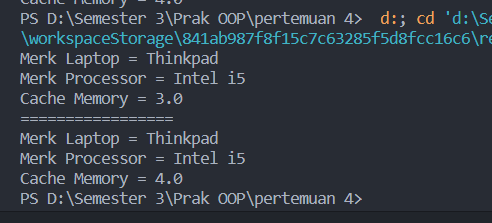
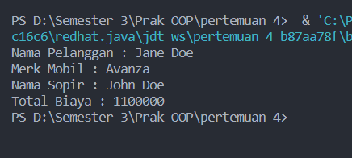
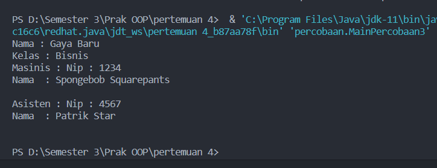
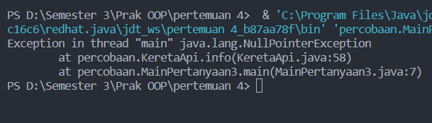
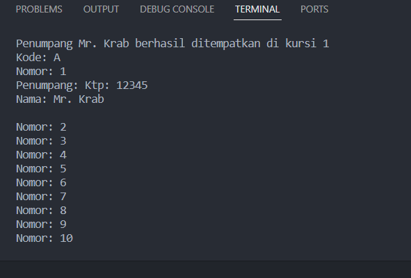
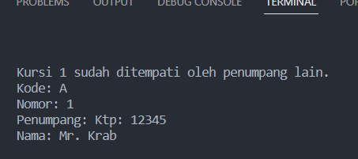

<h1 align="center">

LAPORAN PRAKTIKUM

Pemprograman Berorerientasi Objek


<h2 align="center">

RIZQI REZA DANUARTA

2241720057

TI-2C

<br><br>

# Latihan Praktikum

## Percobaan 1

```java
package percobaan;

/**
 * Processor
 */
public class Processor {
    private String merk;
    private double cache;

    public Processor(String merk, double cache) {
        this.merk = merk;
        this.cache = cache;
    }

    public void setMerk(String merk) {
        this.merk = merk;
    }

    public String getMerk() {
        return merk;
    }

    public void setCache(double cache) {
        this.cache = cache;
    }

    public double getCache() {
        return cache;
    }

    public void info() {
        System.out.printf("Merk Processor = %s\n", merk);
        System.out.printf("Cache Memory = %s", cache);
    }
}
package percobaan;

public class Laptop {
    private String merk;
    private Processor proc = new Processor(merk, 0);

    public Laptop(String merk, Processor proc) {
        this.merk = merk;
        this.proc = proc;
    }

    public void setMerk(String merk) {
        this.merk = merk;
    }

    public String getMerk() {
        return merk;
    }

    public void setProc(Processor proc) {
        this.proc = proc;
    }

    public Processor getProc() {
        return proc;
    }

    public void info() {
        System.out.println("Merk Laptop = " + merk);
        proc.info();
    }
}
package percobaan;

public class MainPercobaan1 {
    public static void main(String[] args) {
        Processor p = new Processor("Intel i5", 3);
        Laptop l = new Laptop("Thinkpad", p);
        l.info();
        System.out.println("\n=================");
        Processor p1 = new Processor(null, 0);
        p1.setMerk("Intel i5");
        p1.setCache(4);
        Laptop l1 = new Laptop(null, p);
        l1.setMerk("Thinkpad");
        l1.setProc(p1);
        l1.info();
    }
}
```

## Hasil Outputnya



### Pertanyaan Percobaan 1

Berdasarkan percobaan 1, jawablah pertanyaan‑pertanyaan yang terkait:

1. Di dalam class Processor dan class Laptop , terdapat method setter dan getter untuk
   masing‑masing atributnya. Apakah gunanya method setter dan getter tersebut ?<br>
   jawaban : kegunaan dari setter dai kedua class tersebut berfungsi untuk kita bisa mengatur atau mengubah nilai pada atribut yang diberikan sedangkan getter berfungsi untuk mengembalikan nilai pada atribut yang sudah diberikan
2. Di dalam class Processor dan class Laptop, masing‑masing terdapat konstruktor
   default dan konstruktor berparameter. Bagaimanakah beda penggunaan dari kedua jenis
   konstruktor tersebut ?<br>
   jawaban : yang membuat perbedaan dari kedua tersebut adalah dari segi penggunaanya dimana konstruktor default digunakan untuk menginisialisasi objek dengan nilai nilai default sedangkan konstruktor berparameter digunakan untuk menginisialisasi objek dengn nilai nilai yang diberikan sebagai argumen saat pembuatan objek langsung
3. Perhatikan class Laptop, di antara 2 atribut yang dimiliki (merk dan proc), atribut
   manakah yang bertipe object ?<br>
   jawaban : yang bertipe objek adalah proc karena variabel proc dibuat dari deklarasi dari class Processor dimana proc ini bertipe objek
4. Perhatikan class Laptop, pada baris manakah yang menunjukan bahwa class Laptop
   memiliki relasi dengan class Processor ?<br>
   jawaban : berikut adalah relasinya
   ```java
   private Processor proc = new Processor(merk, 0);
   ```
5. Perhatikan pada class Laptop , Apakah guna dari sintaks proc.info() ?<br>
   jawban : sintaks tersebut digunakan untuk memanggil method info pada class Processor
6. Pada class MainPercobaan1, terdapat baris kode:
   Laptop l = new Laptop("Thinkpad", p);.
   Apakah p tersebut ?
   Dan apakah yang terjadi jika baris kode tersebut diubah menjadi:Page 4 of 10 Laptop l = new Laptop("Thinkpad", new Processor("Intel i5", 3)); <br>Bagaimanakah hasil program saat dijalankan, apakah ada perubahan ?<br>
   jawaban : p yang terdapat pada baris Laptop l itu adalah argumen deklarasi objek dari class Processor yang akan dipanggil pada deklarasi objek di l pada Laptop lalu jika kode program diubah seperti yang di jobsheet maka tidak ada perubahan karena itu sama halnya seperti yang sebelum

## Percobaan 2

```java
package percobaan;

public class Mobil {
    private String nama;
    private int biaya;

    public Mobil(String nama, int biaya) {
        this.nama = nama;
        this.biaya = biaya;
    }

    public void setnama(String nama) {
        this.nama = nama;
    }

    public String getNama() {
        return nama;
    }

    public void setBiaya(int biaya) {
        this.biaya = biaya;
    }

    public int getBiaya() {
        return biaya;
    }

    public int hitungBiayaMobil(int hari) {
        return biaya * hari;
    }

}
package percobaan;

public class Sopir {
    private String nama;
    private int biaya;

    public Sopir(String nama, int biaya) {
        this.nama = nama;
        this.biaya = biaya;
    }

    public void setnama(String nama) {
        this.nama = nama;
    }

    public String getNama() {
        return nama;
    }

    public void setBiaya(int biaya) {
        this.biaya = biaya;
    }

    public int getBiaya() {
        return biaya;
    }

    public int hitungBiayaSopir(int hari) {
        return biaya * hari;
    }
}
package percobaan;

public class Pelanggan {
    private String nama;
    private Mobil mobil;
    private Sopir sopir;
    private int hari;

    public Pelanggan(String nama, Mobil mobil, Sopir sopir, int hari) {
        this.nama = nama;
        this.mobil = mobil;
        this.sopir = sopir;
        this.hari = hari;
    }

    public void setNama(String nama) {
        this.nama = nama;
    }

    public String getNama() {
        return nama;
    }

    public void setMobil(Mobil mobil) {
        this.mobil = mobil;
    }

    public Mobil getMobil() {
        return mobil;
    }

    public void setSopir(Sopir sopir) {
        this.sopir = sopir;
    }

    public Sopir getSopir() {
        return sopir;
    }

    public void setHari(int hari) {
        this.hari = hari;
    }

    public int getHari() {
        return hari;
    }

    public int hitungBiayaTotal() {
        return mobil.hitungBiayaMobil(hari) + sopir.hitungBiayaSopir(hari);
    }

    public void info() {
        System.out.println("Nama Pelanggan : " + nama);
        System.out.println("Merk Mobil : " + mobil.getNama());
        System.out.println("Nama Sopir : " + sopir.getNama());
        System.out.println("Total Biaya : " + hitungBiayaTotal());
    }
}
```

## Hasil Outputnya



### Pertanyaan Percobaan 2

1. Perhatikan class Pelanggan. Pada baris program manakah yang menunjukan bahwa class
   Pelanggan memiliki relasi dengan class Mobil dan class Sopir ?<br>
   Jawaban : pada line ke 5 dan ke 6
   `java
private Mobil mobil;
private Sopir sopir;
`
2. Perhatikan method hitungBiayaSopir pada class Sopir, serta method hitungBiayaMobil pada class Mobil. Mengapa menurut Anda method tersebut harus
   memiliki argument hari ? <br>
   Jawaban : karena method tersebut juga diperlukan untuk nanti buat menghitung semua total biaya
3. Perhatikan kode dari class Pelanggan. Untuk apakah perintah
   mobil.hitungBiayaMobil(hari) dan sopir.hitungBiayaSopir(hari) ?<br>
   jawaban : digunakan untuk menjumlah dan mentotal semua biaya yang tertera
4. Perhatikan class MainPercobaan2. Untuk apakah sintaks p.setMobil(m) dan p.setSopir(s) ?<br>
   jawaban : sintaks tersebut digunakan untuk mendeklarasikan objek dari class mobil dan objek dari clas sopir agar objek pelanggan mendapatkan nama mobil apa dan siapa sopirnya makanya terdapat deklarasi tersebut
5. Perhatikan class MainPercobaan2. Untuk apakah proses p.hitungBiayaTotal() tersebut ? <br>
   jawaban : digunakan untuk memanggil method yang terdapat pada class pelanggan dan digunakan untuk menghitung semua total
6. Perhatikan class MainPercobaan2, coba tambahkan pada baris terakhir dari method
   main dan amati perubahan saat di‑run!Page 6 of 10 System.out.println(p.getMobil().getMerk()); Jadi untuk apakah sintaks p.getMobil().getMerk() yang ada di dalam method main tersebut?<br>
   jawaban : jika pada main ditambhkan kode yang di jobsheet maka hasilnya pelanggan akan memanggil method dari class mobil serta yang akan ditampilkan adalah nama merk mobil karena pada baris tersebut juga terdapat deklarasi pemanggilan untuk merk mobil

## Percobaan 3

```java
package percobaan;

public class Pegawai {
    private String nip, nama;

    public Pegawai(String nip, String nama) {
        this.nama = nama;
        this.nip = nip;
    }

    public void setNip(String nip) {
        this.nip = nip;
    }

    public String getNip() {
        return nip;
    }

    public void setNama(String nama) {
        this.nama = nama;
    }

    public String getNama() {
        return nama;
    }

    public String info() {
        String info = "";
        info += "Nip : " + this.nip + "\n";
        info += "Nama  : " + this.nama + "\n";
        return info;
    }
}
package percobaan;

public class KeretaApi {
    private String nama, kelas;
    private Pegawai masinis;
    private Pegawai asisten;

    public KeretaApi(String nama, String kelas, Pegawai masinis) {
        this.nama = nama;
        this.kelas = kelas;
        this.masinis = masinis;
    }

    public KeretaApi(String nama, String kelas, Pegawai masinis, Pegawai asisten) {
        this.nama = nama;
        this.kelas = kelas;
        this.masinis = masinis;
        this.asisten = asisten;
    }

    public void setnama(String nama) {
        this.nama = nama;
    }

    public String getNama() {
        return nama;
    }

    public void setKelas(String kelas) {
        this.kelas = kelas;
    }

    public String getKelas() {
        return kelas;
    }

    public void setMasinis(Pegawai masinis) {
        this.masinis = masinis;
    }

    public Pegawai getMasinis() {
        return masinis;
    }

    public void setAsisten(Pegawai asisten) {
        this.asisten = asisten;
    }

    public Pegawai getAsisten() {
        return asisten;
    }

    public String info() {
        String info = "";
        info += "Nama : " + this.nama + "\n";
        info += "Kelas : " + this.kelas + "\n";
        info += "Masinis : " + this.masinis.info() + "\n";
        info += "Asisten : " + this.asisten.info() + "\n";
        return info;
    }

}
package percobaan;

public class MainPercobaan3 {
    public static void main(String[] args) {
        Pegawai masinis = new Pegawai("1234", "Spongebob Squarepants");
        Pegawai asisten = new Pegawai("4567", "Patrik Star");
        KeretaApi keretaApi = new KeretaApi("Gaya Baru", "Bisnis", masinis, asisten);

        System.out.println(keretaApi.info());
    }
}
```

## Hasil Outputnya



### Pertanyaan Percobaan 3

1. Di dalam method info() pada class KeretaApi, baris this.masinis.info() dan this.asisten.info() digunakan untuk apa ?<br>
   jawaban : digunakan untuk memnggail hasil atribut yang sudah diisi dimana nanti akan ditampilkan pada method info pada class KeretaApi
2. Buatlah main program baru dengan nama class MainPertanyaan pada package yang sama. Tambahkan kode berikut pada method main() Pegawai masinis = new Pegawai("1234", "Spongebob
   Squarepants");
   KeretaApi keretaApi = new KeretaApi("Gaya Baru", "Bisnis",
   masinis); ! <br>
   jawaban : hasilnya adalah eror
3. Apa hasil output dari main program tersebut ? Mengapa hal tersebut dapat terjadi ? <br>
   jawaban : hasilnya eror seperti gambar berikut ini  karena pada class main tersebut masih belum ada inisialisasi untuk objek asisten
4. Perbaiki class KeretaApi sehingga program dapat berjalan !<br>
   jawaban :

```java
package percobaan;

public class MainPertanyaan3 {
    public static void main(String[] args) {
        Pegawai masinis = new Pegawai("1234", "Spongebob Squarepants");
        Pegawai asisten = new Pegawai("4567", "Patrik Star");
        KeretaApi keretaApi = new KeretaApi("Gaya Baru", "Bisnis", masinis, asisten);
        System.out.println(keretaApi.info());
    }
}
```

## Percobaan 4

```java
package percobaan;

public class Penumpang {
    private String ktp, nama;

    public Penumpang(String ktp, String nama) {
        this.ktp = ktp;
        this.nama = nama;
    }

    public void setKtp(String ktp) {
        this.ktp = ktp;
    }

    public String getKtp() {
        return ktp;
    }

    public void setNama(String nama) {
        this.nama = nama;
    }

    public String getNama() {
        return nama;
    }

    public String info() {
        String info = "";
        info += "Ktp: " + ktp + "\n";
        info += "Nama: " + nama + "\n";
        return info;
    }
}
package percobaan;

public class Kursi {
    private String nomor;
    private Penumpang penumpang;

    public Kursi(String nomor) {
        this.nomor = nomor;
    }

    public void setNomor(String nomor) {
        this.nomor = nomor;
    }

    public String getNomor() {
        return nomor;
    }

    public void setPenumpang(Penumpang penumpang) {
        this.penumpang = penumpang;
    }

    public Penumpang getpenumpang() {
        return penumpang;
    }

    public String info() {
        String info = "";
        info += "Nomor: " + nomor + "\n";
        if (this.penumpang != null) {
            info += "Penumpang: " + penumpang.info() + "\n";
        }
        return info;
    }
}
package percobaan;

public class Gerbong {
    private String kode;
    private Kursi[] arrayKursi;

    public Gerbong(String kode, int jumlah) {
        this.kode = kode;
        this.arrayKursi = new Kursi[jumlah];
        this.initKursi();
    }

    private void initKursi() {
        for (int i = 0; i < arrayKursi.length; i++) {
            this.arrayKursi[i] = new Kursi(String.valueOf(i + 1));
        }
    }

    public void setKode(String setkode) {
        this.kode = setkode;
    }

    public String getKode() {
        return kode;
    }

    public void setPenumpang(Penumpang penumpang, int nomor) {
        this.arrayKursi[nomor - 1].setPenumpang(penumpang);
    }

    public Kursi[] getArrayKursi() {
        return arrayKursi;
    }

    public String info() {
        String info = "";
        info += "Kode: " + kode + "\n";
        for (Kursi kursi : arrayKursi) {
            info += kursi.info();
        }
        return info;
    }
}
```

## Hasil Output



### Pertanyaan Percobaan 4

1. Pada main program dalam class MainPercobaan4, berapakah jumlah kursi dalam Gerbong A ?<br>
   jawaban : jumlah kursi pada gerbong A adalah 10 terlihat pada class mainPercobaan4 pada line 6
2. Perhatikan potongan kode pada method info() dalam class Kursi. Apa maksud kode tersebut ?<br>
   jawaban : digunakan untuk mengecek apakah ada penumpang di kursi tersebut sebelum menggabungkan informasi penumpang ke dalam output info. Jika this.penumpang tidak null (berarti ada penumpang), maka informasi penumpang akan dimasukkan ke dalam string info.
3. Mengapa pada method setPenumpang() dalam class Gerbong, nilai nomor dikurangi dengan angka 1 ?<br>
   jawaban : karena dalam array selalu dimulai dengan indeks 0 maka dari itu dikurangi nilai angka 1
4. Instansiasi objek baru budi dengan tipe Penumpang, kemudian masukkan objek barutersebut pada gerbong dengan gerbong setPenumpang(budi, 1). Apakah yang terjadi <br>
   jawaban : maka object budi akan masuk kedalam kursi pertama didalam gerbong yang bersangkutan
5. Modifikasi program sehingga tidak diperkenankan untuk menduduki kursi yang sudah ada penumpang lain !<br>
   jawaban :

```java
public void setPenumpang(Penumpang penumpang, int nomor) {
        Kursi kursi = this.arrayKursi[nomor - 1];
        if (kursi.getpenumpang() == null) {
            kursi.setPenumpang(penumpang);
            System.out.println("Penumpang " + penumpang.getNama() + " berhasil ditempatkan di kursi " + nomor);
        } else {
            System.out.println("Kursi " + nomor + " sudah ditempati oleh penumpang lain.");
        }
    }
```

Hasil Outputnya

