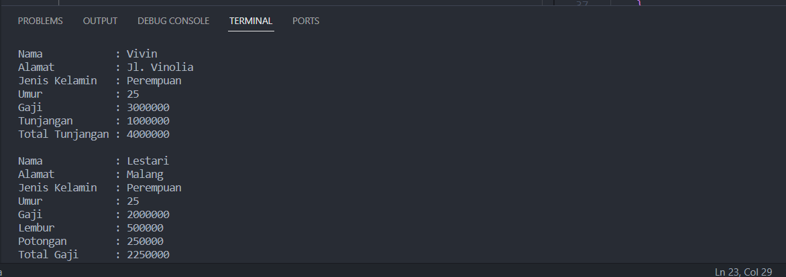
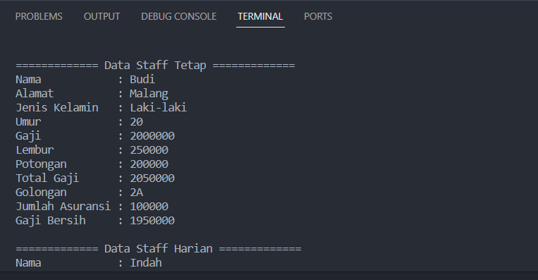

<h1 align="center">

LAPORAN PRAKTIKUM

Pemprograman Berorerientasi Objek


<h2 align="center">

RIZQI REZA DANUARTA

2241720057

TI-2C

## Latihan Praktikum 3.1


<br>

1. Buatlah class Karyawan

```java
package percobaan;

public class Karyawan {
    public String nama, alamat, jk;
    public int umur, gaji;

    public Karyawan() {
    }

    public Karyawan(String nama, String alamat, String jk, int umur, int gaji) {
        this.nama = nama;
        this.alamat = alamat;
        this.jk = jk;
        this.umur = umur;
        this.gaji = gaji;
    }

    public void tampilKaryawan() {
        System.out.println("Nama\t\t: " + nama);
        System.out.println("Alamat\t\t: " + alamat);
        System.out.println("Jenis Kelamin\t: " + jk);
        System.out.println("Umur\t\t: " + umur);
        System.out.println("Gaji\t\t: " + gaji);
    }
}
```

2. Buatlah class Manage

```java
package percobaan;

public class Manager extends Karyawan{
    public int tunjangan;

    public Manager(){}

    public void tampilManager(){
        super.tampilKaryawan();
        System.out.println("Tunjangan\t: "+tunjangan);
        System.out.println("Total Tunjangan\t: "+(super.gaji + tunjangan));
    }
}

```

3. Buatlah class Staff

```java
package percobaan;

public class Staff extends Karyawan{
    public int lembur, potongan;

    public Staff () {}

    public Staff(int lembur, int potongan, String nama, String alamat, String jk, int umur, int gaji) {
        super(nama, alamat, jk, umur, gaji);
        this.lembur = lembur;
        this.potongan = potongan;
    }

    public void tampilDataStaff(){
        super.tampilKaryawan();
        System.out.println("Lembur\t\t: " + lembur);
        System.out.println("Potongan\t: " + potongan);
        System.out.println("Total Gaji\t: " + (gaji + lembur - potongan));
    }

}

```

4. Buatlah class inheritance1

```java
package percobaan;

public class Inheritance1 {
    public static void main(String[] args) {
        Manager M = new Manager();
        M.nama = "Vivin";
        M.alamat = "Jl. Vinolia";
        M.umur = 25;
        M.jk = "Perempuan";
        M.gaji = 3000000;
        M.tunjangan = 1000000;
        M.tampilManager();

        System.out.println("");

        Staff S = new Staff();
        S.nama = "Lestari";
        S.alamat = "Malang";
        S.umur = 25;
        S.jk = "Perempuan";
        S.gaji = 2000000;
        S.lembur = 500000;
        S.potongan = 250000;
        S.tampilDataStaff();


    }
}
```

5. Jalankan program, maka tampilanya adalah sebagai berikut
   

### Pertanyaan

1. Sebutkan class mana yang termasuk super class dan sub class dari percobaan 1 diatas!
   jawaban : super classnya adalah class Karyawan dan sub classnya adalah class Manager dan class Staff.
2. Kata kunci apakah yang digunakan untuk menurunkan suatu class ke class yang lain?
   jawaban : extend adalah kata kunci yang digunakan untuk menurunkan suatu class ke class lainnya.
3. Perhatikan kode program pada class Manager, atribut apa saja yang dimiliki oleh class tersebut? Sebutkan atribut mana saja yang diwarisi dari class Karyawan!
   jawaban : pada class manager terdapat beberapa atribut yaitu atribut tunjangan, nama,alamat,jk,umur dan gaji namun atribut yang diwarisi class karyawan yaitu semuanya kecuali atribut tunjangan.
4. Jelaskan kata kunci super pada potongan program dibawah ini yang terdapat pada class Manager

```java
 System.out.println("Total Gaji\t: " + (super.gaji + tunjangan));
```

    jawaban : kata kuncisuper digunakan untuk merujuk ke superclaas atau class yang diwarisi pada potongan kode program diatas menunjukkan bahwasuper.gaji mengacu pada atribut gaji dari superclass Karyawan.

5. Program pada percobaan 1 diatas termasuk dalam jenis inheritance apa? Jelaskan alasannya
   jawaban : jenis inheritance karena setiap subclass hanya memiliki satu superclass, yaitu class "Karyawan." Dalam inheritance ini, class "Manager" dan class "Staff" mewarisi sifat-sifat dari class "Karyawan."

## Latihan Praktikum 4.1


- Berdasarkan program yang sudah anda buat pada percobaan 1 sebelumnya tambahkan dua class yaitu class StaffTetap dan class StaffHarian. Kode Programnya adalah sebagai berikut : <br>

1. Class StaffTetap.java

```java
package percobaan;

public class StaffTetap extends Staff{
       public String golongan;
       public int asuransi;

       public StaffTetap(){
       }

    public StaffTetap(String golongan, int asuransi) {
        this.golongan = golongan;
        this.asuransi = asuransi;
    }

    public StaffTetap(String nama, String alamat, String jk, int umur, int gaji, int lembur, int potongan,String golongan, int asuransi) {
        super(lembur, potongan, nama, alamat, jk, umur, gaji);
        this.golongan = golongan;
        this.asuransi = asuransi;
    }

    public void tampilStaffTetap(){
        System.out.println("============= Data Staff Tetap =============");
        super.tampilDataStaff();
        System.out.println("Golongan\t: "+ golongan);
        System.out.println("Jumlah Asuransi\t: "+ asuransi);
        System.out.println("Gaji Bersih\t: "+(gaji+lembur-potongan-asuransi));
    }
}
```

2. Class StaffHarian.java

```java
package percobaan;

public class StaffHarian extends Staff{
    public int jmlJamKerja;

    public StaffHarian() {
    }

    public StaffHarian(String nama, String alamat, String jk, int umur, int gaji,int lembur, int potongan, int jmlJamKerja) {
        super(lembur, potongan, nama, alamat, jk, umur, gaji);
        this.jmlJamKerja = jmlJamKerja;
    }

    public void tampilStaffHarian(){
        System.out.println("============= Data Staff Harian =============");
        super.tampilDataStaff();
        System.out.println("Jumlah Jam Kerja: "+ jmlJamKerja);
        System.out.println("Gaji Bersih\t: "+(gaji*jmlJamKerja+lembur-potongan));
    }
}

```

- Setelah membuat dua class diatas kemudian edit class inheritance1.java menjadi sebagai berikut

```java
package percobaan;

public class Inheritance1 {
    public static void main(String[] args) {
        Manager M = new Manager();
        M.nama = "Vivin";
        M.alamat = "Jl. Vinolia";
        M.umur = 25;
        M.jk = "Perempuan";
        M.gaji = 3000000;
        M.tunjangan = 1000000;
        M.tampilManager();

        System.out.println("");

        Staff S = new Staff();
        S.nama = "Lestari";
        S.alamat = "Malang";
        S.umur = 25;
        S.jk = "Perempuan";
        S.gaji = 2000000;
        S.lembur = 500000;
        S.potongan = 250000;
        S.tampilDataStaff();

        System.out.println("");

        StaffTetap ST = new StaffTetap("Budi", "Malang", "Laki-laki", 20, 2000000,
        250000, 200000, "2A", 100000);
        ST.tampilStaffTetap();

        System.out.println("");

        StaffHarian SH = new StaffHarian("Indah", "Malang", "Perempuan", 27, 10000,
        100000, 50000, 100);
        SH.tampilStaffHarian();
    }
}
```

- Jalankan program maka tampilanny adalah sebagai berikut:
  
  

### Pertanyaan

1. Berdasarkan class diatas manakah yang termasuk single inheritance dan mana yang termasuk multilevel inheritance
   jawaban : class StaffTetap dan StaffHarian termasuk multilevel inherintance karena keduanya merupakan subclass dari Staff yang pada gilirannya merupakan subclass dari Karyawan.
2. Perhatikan kode program class StaffTetap dan StaffHarian, atribut apa saja yang dimiliki oleh class tersebut? Sebutkan atribut mana saja yang diwarisi dari class Staff
   jawaban :Class StaffTetap memiliki atribut golongan dan asuransi, yang tidak diwarisi dari class Staff. Atribut yang diwarisi dari class Staff ke class StaffTetap adalah nama, alamat, jk, umur, gaji, lembur, dan potongan.

   Class StaffHarian memiliki atribut jmlJamKerja, yang juga tidak diwarisi dari class Staff. Atribut yang diwarisi dari class Staff ke class StaffHarian adalah nama, alamat, jk, umur, gaji, lembur, dan potongan.

3. Apakah fungsi potongan program berikut pada class StaffHarian

```java
super(lembur, potongan, nama, alamat, jk, umur, gaji);
```

    jawaban : perintah ini memanggil constructor superclass Staff dengan parameter yang sesuai. Dengan ini, objek StaffHarian dapat diinisialisasi dengan data yang diteruskan ke constructor superclass Staff.

4. Apakah fungsi potongan program berikut pada class StaffHarian

```java
super.tampilDataStaff();
```

    jawaban : digunakan untuk memanggil metode tampilDataStaff() yang ada dalam superclass Staff

5. Perhatikan kode program dibawah ini yang terdapat pada class StaffTetap

```java
 System.out.println("Gaji Bersih\t: " + (gaji + lembur - potongan - asuransi));
```

Terlihat dipotongan program diatas atribut gaji, lembur dan potongan dapat diakses langsung. Kenapa hal ini bisa terjadi dan bagaimana class StaffTetap memiliki atribut gaji,
lembur, dan potongan padahal dalam class tersebut tidak dideklarasikan atribut gaji, lembur,
dan potongan?

    jawaban :ni karena class StaffTetap adalah subclass dari Staff, dan semua atribut yang ada dalam Staff dapat diakses oleh StaffTetap tanpa perlu deklarasi ulang.

## Tugas


1. class Komputer.java

```java
package tugas;

public class Komputer {
    public String merk, jnsProcessor;
    public int kecProcessor, sizeMemory;

    public Komputer() {
    }

    public Komputer(String merk, String jnsProcessor, int kecProcessor, int sizeMemory) {
        this.merk = merk;
        this.jnsProcessor = jnsProcessor;
        this.kecProcessor = kecProcessor;
        this.sizeMemory = sizeMemory;
    }

    public void tampilData() {
        System.out.println("Merk\t\t\t: " + merk);
        System.out.println("Jenis Processor\t\t: " + jnsProcessor);
        System.out.println("Kecepatan Processor\t: " + kecProcessor + " GHz");
        System.out.println("Size Memory\t\t: " + sizeMemory + " GB");
    }
}
```

2. Laptop.java

```java
package tugas;

public class Laptop extends Komputer {
    public String jnsBaterai;

    public Laptop() {
    }

    public Laptop(String jnsBaterai, String merk, String jnsProcessor, int kecProcessor, int sizeMemory) {
        super(merk, jnsProcessor, kecProcessor, sizeMemory);
        this.jnsBaterai = jnsBaterai;
    }

    public void tampilLaptop() {
        super.tampilData();
        System.out.println("Jenis Baterai\t\t: " + jnsBaterai);
    }
}
```

3. class Mac.java

```java
package tugas;

public class Mac extends Laptop {
    public String security;

    public Mac() {
    }

    public Mac(String security, String jnsBaterai, String merk, String jnsProcessor, int kecProcessor, int sizeMemory) {
        super(jnsBaterai, merk, jnsProcessor, kecProcessor, sizeMemory);
        this.security = security;
    }

    public void tampilMac() {
        super.tampilData();
        System.out.println("Security\t\t: " + security);
    }
}
```

4. Pc.java

```java
package tugas;

public class Pc extends Komputer {
    public int ukuranMonitor;

    public Pc() {
    }

    public Pc(int ukuranMonitor, String merk, String jnsProcessor, int kecProcessor, int sizeMemory) {
        super(merk, jnsProcessor, kecProcessor, sizeMemory);
        this.ukuranMonitor = ukuranMonitor;
    }

    public void tampilPc() {
        super.tampilData();
        System.out.println("Ukuran Monitor\t\t: " + ukuranMonitor + " inci");
    }
}

```

5. Windows.java

```java
package tugas;

public class Windows extends Laptop {
    public String fitur;

    public Windows() {
    }

    public Windows(String fitur, String jnsBaterai, String merk, String jnsProcessor, int kecProcessor,
            int sizeMemory) {
        super(jnsBaterai, merk, jnsProcessor, kecProcessor, sizeMemory);
        this.fitur = fitur;
    }

    public void tampilWindows() {
        super.tampilData();
        System.out.println("Fitur\t\t\t: " + fitur);
    }

}

```

6. Main.java

```java
package tugas;

public class Main {
    public static void main(String[] args) {
        System.out.println("=============================================");
        System.out.println("           Informasi Perangkat Elektronik     ");
        System.out.println("=============================================");
        System.out.println();

        Laptop laptop = new Laptop("Li-Ion", "HP Envy 13", "Intel Core i7", 1, 16);
        System.out.println("=============== Informasi Laptop ===============");
        laptop.tampilLaptop();
        System.out.println();

        Pc pc = new Pc(25, "Dell XPS 8940", "Intel Core i9", 2, 64);
        System.out.println("=============== Informasi PC ===============");
        pc.tampilPc();
        System.out.println();

        Mac mac = new Mac("Apple M1 chip", "Li-Po", "MacBook Air", "Apple M1", 1, 8);
        System.out.println("=============== Informasi MacBook ===============");
        mac.tampilMac();
        System.out.println();

        Windows windows = new Windows("Backlit Keyboard", "Li-Ion", "Asus ZenBook", "AMD Ryzen 7", 2, 16);
        System.out.println("=============== Informasi Laptop Windows ===============");
        windows.tampilWindows();
        System.out.println();

        System.out.println("=============================================");
    }
}

```

### Hasil Outputnya


