<h1 align="center">

LAPORAN PRAKTIKUM

Pemprograman Berorerientasi Objek


<h2 align="center">

RIZQI REZA DANUARTA

2241720057

TI-2C

## Latihan Praktikum

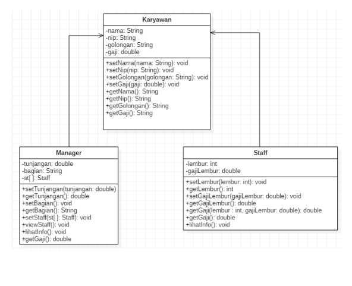
<br>

1. Buatlah class Karyawan

```java
package percobaan;

public class Karyawan {
    private String nama, nip, golongan;
    private double gaji;

    public String getNama() {
        return nama;
    }

    public void setNama(String nama) {
        this.nama = nama;
    }

    public String getNip() {
        return nip;
    }

    public void setNip(String nip) {
        this.nip = nip;
    }

    public String getGolongan() {
        return golongan;
    }

    public void setGolongan(String golongan) {
        this.golongan = golongan;
        switch (golongan.charAt(0)) {
            case '1':
                this.gaji = 5000000;
                break;
            case '2':
                this.gaji = 3000000;
                break;
            case '3':
                this.gaji = 2000000;
                break;
            case '4':
                this.gaji = 1000000;
                break;
            case '5':
                this.gaji = 750000;
                break;
        }
    }

    public double getGaji() {
        return gaji;
    }

    public void setGaji(double gaji) {
        this.gaji = gaji;
    }

}
```

2. Buatlah class Manager

```java
package percobaan;

public class Manager extends Karyawan {
    private double tunjangan;
    private String bagian;
    private Staff st[];

    public double getTunjangan() {
        return tunjangan;
    }

    public void setTunjangan(double tunjangan) {
        this.tunjangan = tunjangan;
    }

    public String getBagian() {
        return bagian;
    }

    public void setBagian(String bagian) {
        this.bagian = bagian;
    }

    public void setSt(Staff[] st) {
        this.st = st;
    }

    public void viewStaff() {
        int i;
        System.out.println("=====================");
        for (i = 0; i < st.length; i++) {
            Staff staff = st[i];
            staff.lihatInfo();
        }
        System.out.println("=====================");
    }

    public void lihatInfo() {
        System.out.println("Manager : " + this.getBagian());
        System.out.println("NIP : " + this.getNip());
        System.out.println("Nama : " + this.getNama());
        System.out.println("Golongan : " + this.getGolongan());
        System.out.printf("Tunjangan : %.0f\n", this.getTunjangan());
        System.out.printf("Gaji : %.0f\n", this.getGaji());
        System.out.println("Bagian : " + this.getBagian());
        this.viewStaff();
    }

    public double getGaji() {
        return super.getGaji() * tunjangan;
    }
}
```

3. Buatlah class Staff

```java
package percobaan;

public class Staff extends Karyawan {
    private int lembur;
    private double gajiLembur;

    public int getLembur() {
        return lembur;
    }

    public void setLembur(int lembur) {
        this.lembur = lembur;
    }

    public double getGajiLembur() {
        return gajiLembur;
    }

    public void setGajiLembur(double gajiLembur) {
        this.gajiLembur = gajiLembur;
    }

    public double getGaji(int lembur, double gajiLembur) {
        return super.getGaji() + lembur * gajiLembur;
    }

    public double getGaji() {
        return super.getGaji() + lembur * gajiLembur;
    }

    public void lihatInfo() {
        System.out.println("NIP : " + this.getNip());
        System.out.println("Nama : " + this.getNama());
        System.out.println("Golongan : " + this.getGolongan());
        System.out.println("Jml Lembur : " + this.getLembur());
        System.out.printf("Gaji Lembur : %.0f\n", this.getGajiLembur());
        System.out.printf("Gaji : %.0f\n", this.getGaji());
    }
}
```

4. Buatlah class Utama

```java
package percobaan;

public class Utama {
    public static void main(String[] args) {
        System.out.println("Program Testing Class Manager & Staff");
        Manager man[] = new Manager[2];
        Staff staff1[] = new Staff[2];
        Staff staff2[] = new Staff[3];

        // Pembuatan Manager
        man[0] = new Manager();
        man[0].setNama("Tedjo");
        man[0].setNip("101");
        man[0].setGolongan("1");
        man[0].setTunjangan(5000000);
        man[0].setBagian("Administrasi");

        man[1] = new Manager();
        man[1].setNama("Atika");
        man[1].setNip("102");
        man[1].setGolongan("1");
        man[1].setTunjangan(2500000);
        man[1].setBagian("Pemasaran");

        staff1[0] = new Staff();
        staff1[0].setNama("Usman");
        staff1[0].setNip("0003");
        staff1[0].setGolongan("2");
        staff1[0].setLembur(10);
        staff1[0].setGajiLembur(10000);

        staff1[1] = new Staff();
        staff1[1].setNama("Anugrah");
        staff1[1].setNip("0005");
        staff1[1].setGolongan("2");
        staff1[1].setLembur(10);
        staff1[1].setGajiLembur(55000);
        man[0].setSt(staff1);

        staff2[0] = new Staff();
        staff2[0].setNama("Hendra");
        staff2[0].setNip("0004");
        staff2[0].setGolongan("3");
        staff2[0].setLembur(15);
        staff2[0].setGajiLembur(5500);

        staff2[1] = new Staff();
        staff2[1].setNama("Arie");
        staff2[1].setNip("0006");
        staff2[1].setGolongan("4");
        staff2[1].setLembur(5);
        staff2[1].setGajiLembur(100000);

        staff2[2] = new Staff();
        staff2[2].setNama("Mentari");
        staff2[2].setNip("0007");
        staff2[2].setGolongan("3");
        staff2[2].setLembur(6);
        staff2[2].setGajiLembur(20000);
        man[1].setSt(staff2);

        // Cetak informasi dari manager dan staffnya
        man[0].lihatInfo();
        man[1].lihatInfo();
    }
}
```

5. Jalankan program, maka tampilanya adalah sebagai berikut
   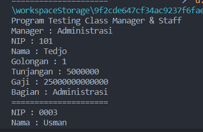
   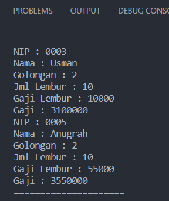
   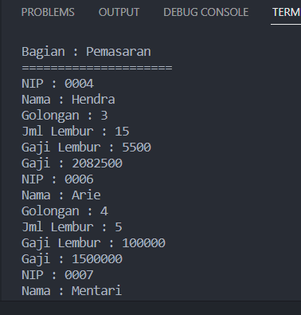
   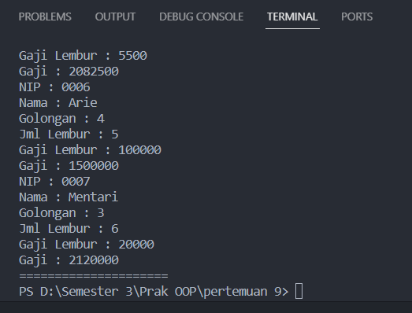

## Latihan

```java
package percobaan;

public class Perkalianku {
    void perkalian(int a, int b) {
        System.out.println(a * b);
    }

    void perkalian(int a, int b, int c) {
        System.out.println(a * b * c);
    }

    public static void main(String[] args) {
        Perkalianku objek = new Perkalianku();
        objek.perkalian(25, 43);
        objek.perkalian(34, 23, 56);
    }
}
```

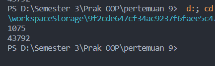
<br>
4.3 Dari source coding diatas terletak dimanakah overloading?<br>

    jawaban : terletak pada bagian berikut ini
    void perkalian(int a, int b) {
    System.out.println(a * b);
    }
    void perkalian(int a, int b, int c) {
    System.out.println(a * b * c);}

4.4 Jika terdapat overloading ada berapa tipe parameter yang berbeda?

    jawaban : terdapat dua metode overloading dengan nama yang sama yaitu perkalian
    Metode pertama memiliki dua parameter tipe int (int a dan int b).Metode kedua memiliki tiga parameter tipe int (int a, int b, dan int c).

```java
package percobaan;

public class Ikan {
    public void swim() {
        System.out.println("IKan bisa berenang");
    }
}
package percobaan;

public class Piranha extends Ikan {
    public void swim() {
        System.out.println("Piranha bisa makan daging");
    }
}
package percobaan;

public class Fish {
    public static void main(String[] args) {
        Ikan a = new Ikan();
        Ikan b = new Ikan();
        a.swim();
        b.swim();
    }
}
```

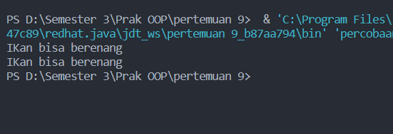

4.5 Dari source coding diatas terletak dimanakah overriding?

    jawaban : terletak pada bagian berikut ini public class Piranha extends Ikan {
    public void swim() {
        System.out.println("Piranha bisa makan daging");
    }}

4.6 Jabarkanlah apabila sourcoding diatas jika terdapat overriding?

    jawaban : Metode swim dalam class Piranha meng-override metode yang sama dari class Ikan. Overriding ini terjadi karena nama, tipe kembalian, dan parameter metode tersebut sama dengan metode yang dideklarasikan di superclass (Ikan). Jadi, ketika objek Piranha dipanggil untuk metode swim, versi metode dari class Piranha yang akan dieksekusi, bukan metode dari class Ikan

## Tugas

### 5.1 Overloading

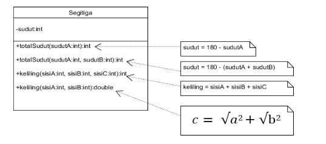

```java
package tugas;

public class Segitiga {
    private int sudut;

    public int totalSudut(int sudutA) {
        this.sudut = 180 - sudutA;
        return this.sudut;
    }

    public int totalSudut(int sudutA, int sudutB) {
        this.sudut = 180 - (sudutA + sudutB);
        return this.sudut;
    }

    public int keliling(int sisiA, int sisiB, int sisiC) {
        return sisiA * sisiB * sisiC;
    }

    public double keliling(int sisiA, int sisiB) {
        return Math.sqrt(Math.pow(sisiA, 2)) + Math.sqrt(Math.pow(sisiB, 2));
    }

    public static void main(String[] args) {
        Segitiga segitiga = new Segitiga();
        System.out.println("Total Sudut dengan 1 parameter : " + segitiga.totalSudut(15));
        System.out.println("Total Sudut dengan 2 parameter : " + segitiga.totalSudut(15, 20));
        System.out.println("Keliling dengan 2 parameter : " + segitiga.keliling(10, 12));
        System.out.println("Keliling dengan 3 parameter : " + segitiga.keliling(4, 5, 6));
    }
}
```

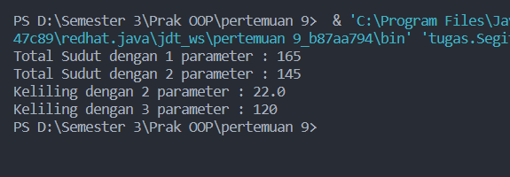

### 5.2 Overriding

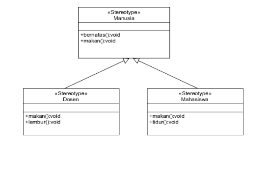

```java
package tugas;

public class Manusia {
    public void bernafas() {
        System.out.println("Manusia bernafas");
    }

    public void makan() {
        System.out.println("Manusia makan");
    }
}
package tugas;

public class Mahasiswa extends Manusia {
    public void makan() {
        System.out.println("Mahasiswa makan");
    }

    public void tidur() {
        System.out.println("Mahasiswa tidur");
    }
}
package tugas;

public class Dosen extends Manusia {
    public void makan() {
        System.out.println("Dosen makan");
    }

    public void lembur() {
        System.out.println("Dosen lembur");
    }
}
package tugas;

public class MainManusia {
    public static void main(String[] args) {
        Manusia manusia;

        manusia = new Manusia();
        manusia.makan();

        manusia = new Dosen();
        manusia.makan();

        manusia = new Mahasiswa();
        manusia.makan();

        System.out.println("\n");

        Manusia m = new Manusia();
        Dosen dsn = new Dosen();
        Mahasiswa mhs = new Mahasiswa();

        infoManusia(m);
        infoDosen(dsn);
        infoMahasiswa(mhs);
    }

    public static void infoManusia(Manusia manusia) {
        manusia.bernafas();
        manusia.makan();
    }

    public static void infoDosen(Dosen dosen) {
        dosen.makan();
        dosen.lembur();
    }

    public static void infoMahasiswa(Mahasiswa mahasiswa) {
        mahasiswa.makan();
        mahasiswa.tidur();
    }
}

```

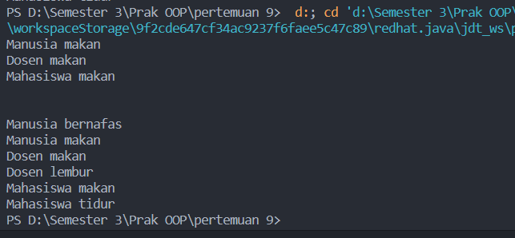
