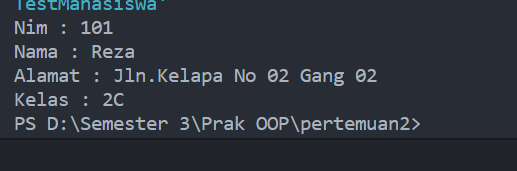
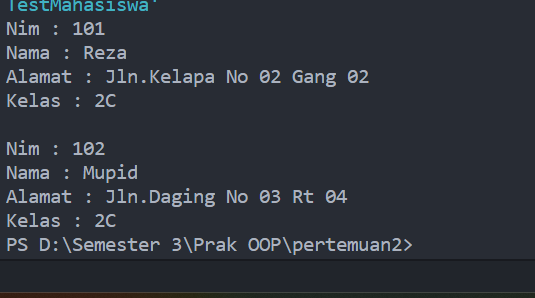
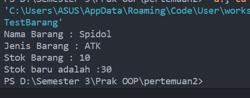
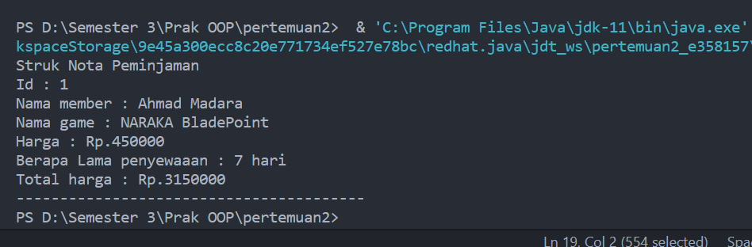

## Percobaan 1

### Studi Kasus 1

Dalam suatu perusahaan salah satu data yang diolah adalah data karyawan. Setiap
karyawan memiliki id, nama, jenis kelamin, jabatan, jabatan, dan gaji. Setiap mahasiswa
juga bisa menampilkan data diri pribadi dan melihat gajinya.

1. Gambarkan desain class diagram dari studi kasus 1!
   answer :

   

2. Sebutkan classs apa saja yang bisa dibuat dari studi kasus 1!
   answer : class yang terdapat pada studi kasus 1 hanya ada 1 yaitu class karyawan

3. Sebutkan atribut beserta tipe datanya yang didapat dapat diidentifikasi dari masing masing class dari studi kasus diatas!
   answer : atribut id tipe data int, atribut nama tipe data String, atribut jenis Kelamin bisa menggunakan dua tipe data yaitu String dan char, stribut jabatan tipe data String dan atribut gaji tipe data float atau double juga bisa.

4. sebutkan method-method yang sudah anda buat dari masing masing class pada studi kasus 1!
   answer : hanya terdapat dua method dalam studi kasus diatas yaitu tampilDataDirikaryawan atau bisa direname menjadi showBiodataKaryawan dan terdapat method untuk tampilkanGajiKaryawan

## Percobaan 2

1. Bukalah text editor atau IDE, misalnya Notepad ++ / netbeans. <br>
2. Ketikkan kode program berikut ini:

```java
public class mahasiswa {

    public int nim;
    public String nama, alamat, kelas;

    public void tampilBiodata() {
        System.out.println("Nim : " + nim);
        System.out.println("Nama : " + nama);
        System.out.println("Alamat : " + alamat);
        System.out.println("Kelas : " + kelas);
    }
}
```

3. Simpan dengan nama file Mahasiswa.java. <br>
4. Untuk dapat mengakses anggota-anggota dari suatu obyek, maka harus dibuat instance
   dari class tersebut terlebih dahulu. Berikut ini adalah cara pengaksesan anggota-
   anggota dari class Mahasiswa dengan membuka file baru kemudian ketikkan kode
   program berikut:

```java
public class TestMahasiswa {
    public static void main(String[] args) {
        mahasiswa mhs1 = new mahasiswa();
        mhs1.nim = 101;
        mhs1.nama = "Reza";
        mhs1.alamat = "Jln.Kelapa No 02 Gang 02 ";
        mhs1.kelas = "2C";
        mhs1.tampilBiodata();
    }
}
```

5. Simpan file dengan TestMahasiswa.java <br>
6. Jalankan class TestMahasiswa <br>
   answer :
   
7. Jelaskan pada bagian mana proses pendeklarasian atribut pada program diatas! <br>
   answer : pendeklarasian atribut terdapat pada class mahasiswa
8. Jelaskan pada bagian mana proses pendeklarasian method pada program diatas! <br>
   answer : masih tetep di class mahasiswa namun terdapat di dalam method tampilBiodataMahasiswa
9. Berapa banyak objek yang di instansiasi pada program diatas! <br>
   answer : masih terdapat satu instasiasi objek yang terdapat didalam kode program diatas yang dimana terletak pada class testMahasiswa
10. Apakah yang sebenarnya dilakukan pada sintaks program “mhs1.nim=101” ? <br>
    answer : pada sintaks tersebut dimana objek yang telah kita buat yaitu mhs1 ingin memanggil atribut nim pada class mahasiswa dan setelah dipanggil baru diinput kan data yang kita inginkan
11. Apakah yang sebenarnya dilakukan pada sintaks program “mhs1.tampilBiodata()” ? <br>
    answer : pada sintaks tersebut setelah beberapa atribut dari class mahasiswa kita panggil dan kita inputkan lalu kita ingin memanggil outputnya atau ingin memumculkan ouputnya maka dari terdapat deklarasi mhs1.tampilBiodata()
12. Instansiasi 2 objek lagi pada program diatas! <br>
    answer :

```java
public class TestMahasiswa {
    public static void main(String[] args) {
        mahasiswa mhs1 = new mahasiswa();
        mahasiswa mhs2 = new mahasiswa();
        mhs1.nim = 101;
        mhs1.nama = "Reza";
        mhs1.alamat = "Jln.Kelapa No 02 Gang 02 ";
        mhs1.kelas = "2C";
        mhs1.tampilBiodata();

        mhs1.nim = 102;
        mhs1.nama = "Mupid";
        mhs1.alamat = "Jln.Daging No 03 Rt 04 ";
        mhs1.kelas = "2C";
        mhs1.tampilBiodata();
    }
}
```

Hasil Outputnya <br>


## Percobaan 3

1. Bukalah text editor atau IDE, misalnya Notepad ++ / netbeans. <br>
2. Ketikkan kode program berikut ini:

```java
public class Barang {
    public String NamaBrg;
    public String JenisBrg;
    public int stok;

    public void tampilBarang() {
        System.out.println("Nama Barang : " + NamaBrg);
        System.out.println("Jenis Barang : " + JenisBrg);
        System.out.println("Stok Barang : " + stok);
    }
    // method dengan argumen dan nilai balik retrun
    public int tambahStok(int brgMasuk) {
        int stokBaru = brgMasuk + stok;
        return stokBaru;
    }
}
```

3.  Simpan dengan nama file Barang.java <br>
4.  Untuk dapat mengakses anggota-anggota dari suatu obyek, maka harus dibuat instance
    dari class tersebut terlebih dahulu. Berikut ini adalah cara pengaksesan anggota-
    anggota dari class Barang dengan membuka file baru kemudian ketikkan kode program
    berikut:

```java
public class TestBarang {
    public static void main(String[] args) {
        Barang brg1 = new Barang();
        brg1.NamaBrg = "Spidol";
        brg1.JenisBrg = "ATK";
        brg1.stok = 10;
        brg1.tampilBarang();
        // menampilkan dan mengisi argumen untuk menambhakan stok barang
        System.out.println("Stok baru adalah :" + brg1.tambahStok(20));
    }
}
```

5. Simpan dengan nama file TestBarang.java
6. Jalankan program tersebut! <br>
   answer :
   

7. Apakah fungsi argumen dalam suatu method?<br>
   answer : fungsinya utamanya adalahmemberikan inputatau data yangdiperlukan karena jika tidak dikasih argumen maka tidak bisa akan dijalankan
8. Ambil kesimpulan tentang kegunaan dari kata kunci return , dan kapan suatu method
   harus memiliki return!
   answer : kesimpulan penggunaan return tergantung dari studi kasus yang kita dapatkan jika yang kita dapatkan harus ada pengembalian maka kita harus menggunakan kata return

## Tugas

1. Suatu toko persewaan video game salah satu yang diolah adalah peminjaman, dimana
   data yang dicatat ketika ada orang yang melakukan peminjaman adalah id, nama
   member, nama game, dan harga yang harus dibayar. Setiap peminjaman bisa
   menampilkan data hasil peminjaman dan harga yang harus dibayar.  
   Buatlah class
   diagram pada studi kasus diatas!
   Penjelasan: <br>
   _ Harga yang harus dibayar diperoleh dari lama sewa x harga.
   _ Diasumsikan 1x transaksi peminjaman game yang dipinjam hanya 1 game saja.
   <br>
   answer :


2. Buatlah program dari class diagram yang sudah anda buat di no 1<br>
   answer :

```java
   public class demoPeminjaman {
    public static void main(String[] args) {
        peminjaman pjm1 = new peminjaman();
        pjm1.id = 1;
        pjm1.namaMember = "Ahmad Madara";
        pjm1.namaGame = "NARAKA BladePoint";
        pjm1.harga = 450000;
        int lama = 7;
        pjm1.tampilData();
        System.out.println("Berapa Lama penyewaaan : " + lama + " hari");
        System.out.println("Total harga : Rp." + pjm1.totalHarga(lama));
    }
    }
    class peminjaman {
    public int id;
    public String namaMember;
    public String namaGame;
    public int harga;

    public int totalHarga(int lamaSewa) {
        int totalHarga = lamaSewa * harga;
        return totalHarga;
    }

    public void tampilData() {
        System.out.println("Struk Nota Peminjaman");
        System.out.println("Id : " + id);
        System.out.println("Nama member : " + namaMember);
        System.out.println("Nama game : " + namaGame);
        System.out.println("Harga : Rp." + harga);
    }
}
```

Hasil Output


3.  Buatlah program sesuai dengan class diagram berikut ini: <br>
    

        answer :

```java
public class lingkaran {
    public double phi, r;

    public double hitungLuas() {
        double luas = phi * r * r;
        return luas;
    }

    public double hitungKeliling() {
        double keliling = 2 * phi * r;
        return keliling;
    }

    public void tampil() {
        System.out.println("phi : " + phi);
        System.out.println("jari jari : " + r);
        System.out.println("Luas Lingkaran : " + hitungLuas());
        System.out.println("Keliling lingkaran : " + hitungKeliling());
    }
}
public class Testlingkaran {
    public static void main(String[] args) {
        lingkaran ll = new lingkaran();
        ll.phi = 22.7;
        ll.r = 7;
        ll.tampil();
    }
}
```

Hasil Outputnya


4. Buatlah program sesuai dengan class diagram berikut ini<br>
   

   answer :

```java
public class TugasBarang {
    public String kode, namaBarang;
    public int hargaDasar;
    public float diskon;

    public int hitungHargaJual() {
        int hargaJual = (int) (hargaDasar - ((diskon * hargaDasar) / 100));
        return hargaJual;
    }

    public void tampil() {
        System.out.println("\n-----------------------------------");
        System.out.println("Kode barang : " + kode);
        System.out.println("Nama barang : " + namaBarang);
        System.out.println("Harga dasar : Rp. " + hargaDasar);
        System.out.println("Diskon : " + diskon + "%");
    }
}
public class TestTugasBarang {
    public static void main(String[] args) {
        TugasBarang brg = new TugasBarang();
        brg.kode = "01";
        brg.namaBarang = "Monitor Pc";
        brg.hargaDasar = 540000;
        brg.diskon = 15;
    }
}
```

Hasil Output

